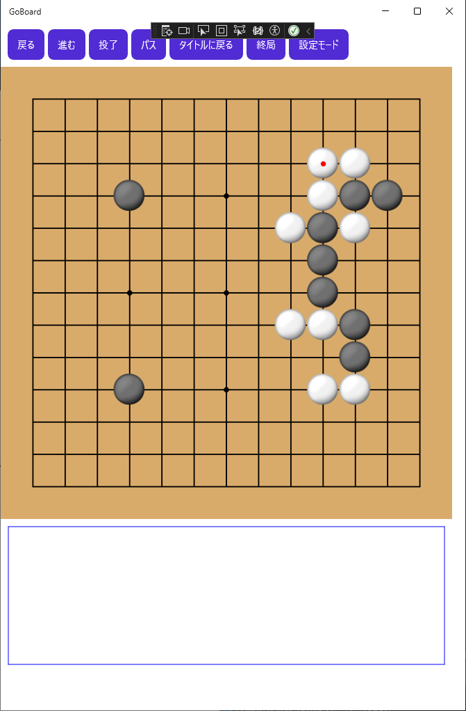

GoSharp
=======

囲碁のC#用ライブラリ
MITライセンスのコードをフォークして .NET8 用に書き換えたものになります。
  
今後以下の機能を追加していく予定です。
1. ~~Undo~~　一旦実装完了
2. ~~Redo~~　一旦実装完了
3. 終局機能 (パスとは別で実装予定)

画面実装例は下記の通り。（画面側のコードは非公開）


----------------------------------------------------------------------------------------------------
----------------------------------------------------------------------------------------------------

A C# class library for the game of Go (a.k.a Igo, Weiqi, Baduk).

## Table of Content
* [Starting a New Game](#starting-a-new-game)
* [Setting Up a Position](#setting-up-a-position)

## Starting a New Game
To start a new game, create a `GameInfo` object, specify the handicap, the board size, 
the starting player and the komi in it. Then create a `Game` object using the `GameInfo` 
parameter constructor.

*Example:*
```c#
GameInfo gi = new GameInfo() { Handicap = 2, StartingPlayer = Content.White };
Game game = new Game(gi);
```

### Making a Move
To make a move, call the `MakeMove` method on a game object. The method will return a 
new game object representing the state of the game after the move. The current 
implementation accepts all moves, including suicide, overwrite and super-ko violating 
moves. 

As shown, there are overloads of the MakeMove method which set an `out bool` parameter 
with `true` or `false` depending on the legality of the move.

*Example:*
```c#
bool legal;
Game postMove = game.MakeMove(3, 3, out legal);
```

### Variations
To start a variation sub-game, call `MakeMove` on any Game node in the tree. All 
variations are recorded in the game tree, and may be exported to SGF.

## Setting Up a Position
To set up a board position without going through all the moves, you can use setup moves 
instead. Setup moves are not checked for legality; they can overwrite, create groups 
with no liberties, etc. They are used, for example, to set up a life-and-death go 
problem, or to show common patterns that appear in game. To use setup moves call the 
`SetupMove` method on a game object.

*Example 1: Setting up a free-placed handicap:*

```c#
GameInfo gi = new GameInfo() { StartingPlayer = Content.White };
Game g = new Game(gi);
g.SetupMove(3, 3, Content.Black); // Place a black stone on the lower left star point.
g.SetupMove(9, 9, Content.Black); // Place a black stone in the center of the board.
g.SetupMove(3, 15, Content.Black); // Place a black stone in the upper left star point.
Console.WriteLine(g.SerializeToSGF(null));
```

When exporting to SGF, the setup moves will appear correctly:

    (;FF[4]PL[W]AB[dd][jj][dp])
